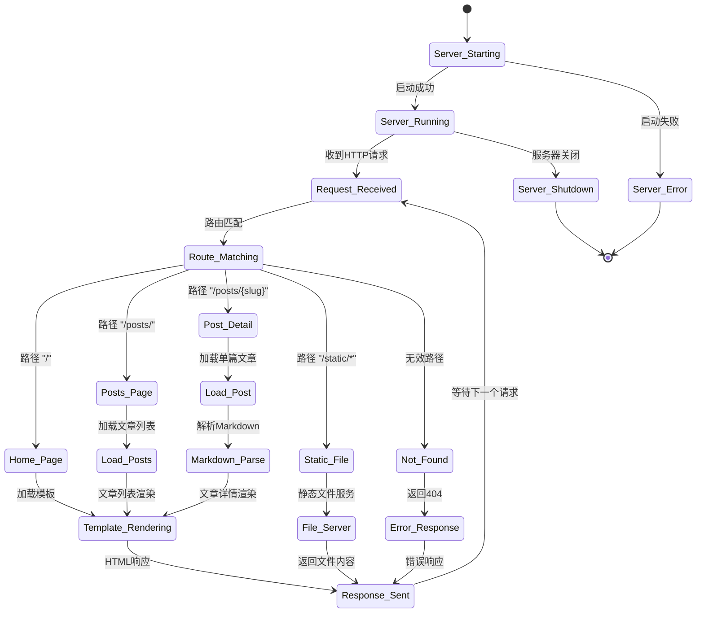

{{template "footer.html" .}}
{{template "nav.html" .}}

constructing workspace
* chrome (1. web search and ai chat; 2. page rendering)
* vs code (explorer + terminal + editor + ai agent)
* whiteboard
* dev journal and documentations (UML diagrams et al...)

